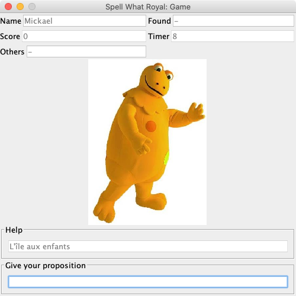

# Tutoriel Streaming HTTP (WebSocket et Server-Sent Event)

L'objectif de cette série d'exercices est d'apprendre à concevoir et développer une application en utilisant des technologies de Streaming HTTP.

Nous utiliserons pour cela plusieurs technologies :

* WebSocket pour la communication bidirectionnelle entre la couche cliente et la couche serveur ;
* Server-Sent Event (SSE) pour la communication monodirectionelle entre la couche serveur et la couche cliente ;
* Service web REST pour une communication de la couche cliente vers la couche serveur.

Nous utiliserons le langage Java et les bibliothèques Tyrus pour le développement des WebSocket et JAX-RS pour le développeur de Server-Sent Event.

Une grande partie du code vous sera donnée comme support dans le répertoire _workspace_. En effet, ces exercices se focaliseront principalement sur les problématiques de manipulation des bibliothèques de Streaming HTTP.

**Buts pédagogiques** : identifier la communication de Streaming HTTP adaptée à un besoin, utiliser la bibliothèque Tyrus pour implémenter un client WebSocket, utiliser la bibliothèque JAX-RS et son module SSE pour implémenter un SSE, débogguer un SSE avec **cURL**.

> Ce dépôt est utilisé dans le cadre d'un cours sur les architectures orientées services que je dispense à l'[ISAE-ENSMA](https://www.ensma.fr) et à l'[Université de Poitiers](http://www.univ-poitiers.fr/) en français. Tous les supports de cours et tutoriaux sont disponibles sur mon blog personnel : [https://mickael-baron.fr/soa/](https://mickael-baron.fr/soa/).

## Prérequis logiciels

Avant de démarrer cette série d'exercices, veuillez préparer votre environnement de développement en installant les outils suivants :

* [Java via OpenJDK](https://jdk.java.net/ "Java") ;
* [Maven](https://maven.apache.org/ "Maven") ;
* [Eclipse](https://www.eclipse.org/ "Eclipse") ;
* [cURL](https://curl.haxx.se "cURL").

## Présentation de l'étude de cas

L'étude de cas utilisée est une application appelée « Spell What Royal ». C'est une application de type jeu dont l'objectif est de deviner un texte à partir d'une image. Une image est ainsi présentée au joueur et celui-ci doit saisir, dans un temps donné, un texte. Si le texte correspond à la valeur demandée, le joueur marque un point.

« Spell What Royal » est un jeu qui peut être joué à plusieurs dans un mode « Battle Royal » (d'où l'utilisation du mot « Royal » dans le titre). Un joueur se connecte à une partie en cours, marqe des points et compare ses points par rapport à une liste des joueurs connectés après chaque manche. Le jeu est en continu, c'est-à-dire qu'il ne s'arrêtera jamais. Un joueur peut intégrer une partie en cours. Si le joueur quitte une partie, ses points seront perdus et le joueur n'apparaîtra plus dans la liste des joueurs.

« Spell What Royal » est une application client/serveur. Le rôle du serveur est de centraliser les connexions des joueurs et de gérer les différentes étapes d'une partie. Une instance d'un serveur gère une seule partie. Le client fournit les interfaces graphiques pour le joueur. Plus précisément, une application de type client lourd a été développée avec le langage Java et la boîte à outils Swing.

Nous montrons ci-dessous, les différentes interfaces graphiques auxquelles le joueur aura à manipuler.

* Interface graphique de connexion pour s'enregistrer sur une partie en cours.

* Interface graphique de mise en attente avant le lancement d'une manche d'identification d'une image.

* Interface graphique du jeu pour l'identification d'une image. La proposition du joueur est donnée dans le champ _Give your proposition_. Une indication pour faciliter la recherche du texte est donnée dans le champ _Help_. Plusieurs autres informations sont renseignées pour donner l'état actuel de la partie à savoir :
  * le nom du joueur dans le champ _Name_ ;
  * le score du joueur dans le champ _Score_ ;
  * le champ _Found_ pour avertir le joueur d'une bonne ou mauvaise réponse (dynamique à chaque saisie de l'utilisateur) ;
  * le champ _Others_ pour indiquer le nombre de joueur ayant trouvé la bonne réponse ;
  * le champ _Timer_ pour retourner la valeur du chronomètre.

* Interface graphique du résultat d'une manche et des scores de tous les joueurs. L'image est visible ainsi que le texte à deviner (champ _solution_).
  * Pour le joueur courant (zone _You_), il est rappelé la valeur qu'il a donnée (champ _value_). Il est aussi indiqué si le joueur a trouvé (champ _Found_) et son score actuel (champ _Score_).
  * Pour tous les joueurs (zone _Other Players_), il est listé le nom, la valeur proposée et le score.

## Ressources

Retrouver les autres tutoriels :

* [Tutoriel sur SOAP-UI pour inspecter et invoquer un service web étendus/SOAP via l’outil SOAP-UI](https://github.com/mickaelbaron/soapui-tutorial) ;
* [Tutoriel sur JAX-WS pour implémenter des services web étendus/SOAP](https://github.com/mickaelbaron/jaxws-tutorial) ;
* [Tutoriel sur JAX-RS pour implémenter des services web REST](https://github.com/mickaelbaron/jaxrs-tutorial) ;
* [Tutoriel sur le développement d'une application basée sur une architecture microservice avec Docker](https://github.com/mickaelbaron/javamicroservices-tutorial).

Pour aller plus loin, vous pouvez consulter les ressources suivantes :

* [Support de cours SOA](https://mickael-baron.fr/soa/introduction-soa "Support de cours SOA") ;
* [Support de cours WSDL](https://mickael-baron.fr/soa/decrire-configurer-wsdl "Support de cours WSDL") ;
* [Support de cours SOAP](https://mickael-baron.fr/soa/communiquer-soap "Support de cours SOAP") ;
* [Support de cours JAX-WS](https://mickael-baron.fr/soa/developper-serviceweb-jaxws "Support de cours JAX-WS").
* [Support de cours REST](https://mickael-baron.fr/soa/comprendre-style-architecture-rest "Support de cours REST") ;
* [Support de cours JAX-RS](https://mickael-baron.fr/soa/developper-serviceweb-rest-jaxrs "Support de cours JAX-RS") ;
* [Support de cours sur le Streaming HTTP](https://mickael-baron.fr/soa/introduction-streaminghttp) ;
* [Support de cours sur la mise en œuvre de technologies de Streaming HTTP avec le langage Java](https://mickael-baron.fr/soa/streaminghttp-mise-en-oeuvre) ;
* [Support de cours sur une introduction aux architectures microservices](https://mickael-baron.fr/soa/introduction-microservices "Support de cours sur une introduction aux architectures microservices") ;
* [Support de cours sur les outils et bibliothèques pour la mise en œuvre d'architectures microservices](https://mickael-baron.fr/soa/microservices-mise-en-oeuvre "Support de cours sur les outils et bibliothèques pour la mise en œuvre d'architectures microservices").
